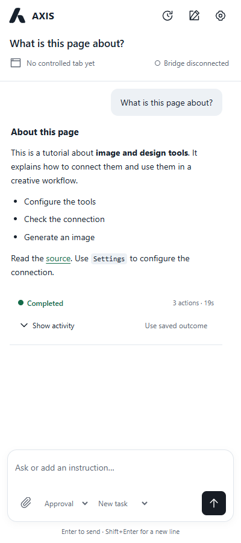
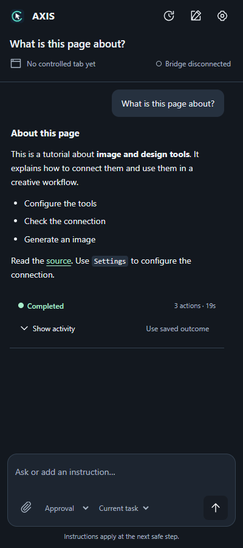
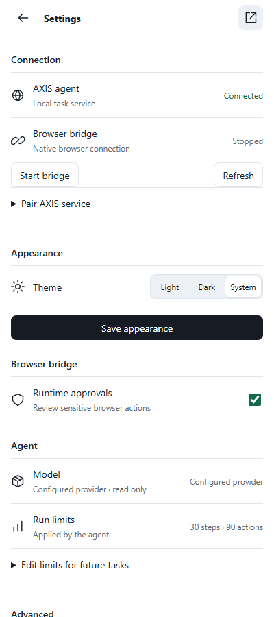
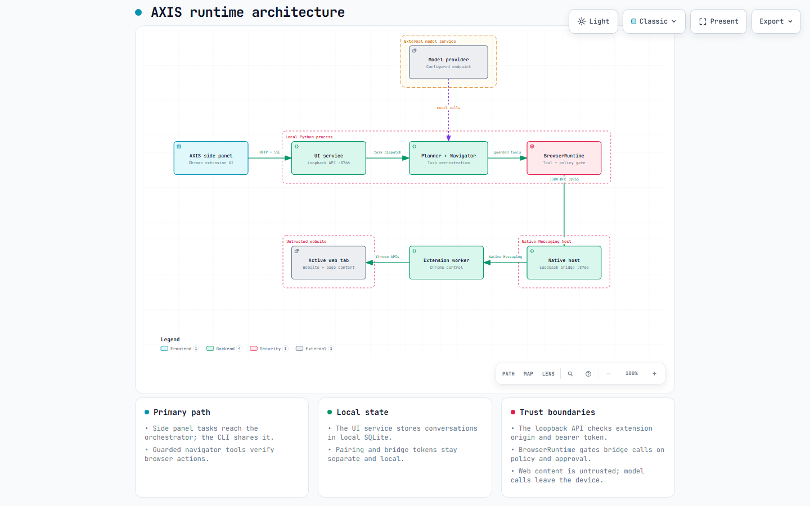

<p align="center">
  
</p>
<h1 align="center">AXIS</h1>
<p align="center"><strong>A browser assistant for the Chrome session you already use</strong></p>

AXIS pairs a **planner** with a **navigator**. The planner decides what to do; the navigator observes and operates your open Chrome tabs through the bundled Browser Agent Bridge. A local service powers the side panel, while the CLI offers the same runtime from a terminal.

**Local browser · Two-agent runtime · Action approvals · Verified outcomes**

[Get started](#get-started) · [Explore the interface](#the-interface) · [See the architecture](#runtime-architecture) · [Read the UI guide](docs/AXIS_UI.md)

## The interface

The Chrome side panel keeps the task, its progress, and the next action together. These are illustrative captures from the repository's local UI fixture.

| Completed answer | Dark appearance | Connection and settings |
| :---: | :---: | :---: |
|  |  |  |

The workspace also supports [action-sized approval prompts](docs/images/axis-approval.png), attachments, conversation history, pause/resume, and light or dark appearance. The [UI guide](docs/AXIS_UI.md) covers these flows in detail.

## How AXIS works

| Step | What happens |
| --- | --- |
| **Plan** | The planner breaks a request into browser goals and checks. |
| **Navigate** | The navigator uses a small set of semantic browser tools to read and act in Chrome. |
| **Guard** | `BrowserRuntime` applies limits, policy, approvals, and cancellation before bridge calls. |
| **Verify** | Browser assertions or completed-download evidence confirm state-changing goals. |
| **Report** | AXIS returns an answer with limitations and source evidence when available. |

The side panel runs against your **existing Chrome profile and signed-in tabs**. AXIS does not launch a disposable test browser.

## Get started

### 1. Install the Python environment

You need **Chrome 116+**, **Python 3.12+**, [uv](https://docs.astral.sh/uv/), and a configured model provider.

```bash
git clone https://github.com/arshagya-ora/Axis_local_agent.git
cd Axis_local_agent
uv sync
```

Copy the provider template to a local, ignored file:

```powershell
Copy-Item axis-agent/.env.example axis-agent/.env
```

On macOS or Linux, use `cp axis-agent/.env.example axis-agent/.env`. Fill in `AXIS_API_KEY`, `AXIS_MODEL`, and `AXIS_OCI_GENAI_PROJECT_OCID` for your provider setup. OCI request signing is also supported when `AXIS_API_KEY` is empty. Keep credentials and private keys out of Git.

### 2. Connect the Chrome bridge

1. Open `chrome://extensions`, enable **Developer mode**, and **Load unpacked** from `browser-agent-bridge/extension`.
2. Copy the extension ID shown by Chrome.
3. Install the native host from the repository root:

   ```powershell
   powershell -ExecutionPolicy Bypass -File .\browser-agent-bridge\scripts\install-native-host-win.ps1 <extension-id>
   ```

   On macOS or Linux, run `./browser-agent-bridge/scripts/install-native-host-unix.sh <extension-id>`.
4. Reload the extension. In **Settings → Connection**, choose **Start bridge** and check that it connects.

### 3. Run the browser workspace

From the repository root, enter `axis-agent` and start the local UI service:

```powershell
cd axis-agent
uv run python -m axis.ui_service
```

In the extension, open **Settings → Connection → Pair AXIS service**. Use `http://127.0.0.1:8766` and the `token` from the local `axis-agent/.axis-ui/pairing.json` file. The service prints the pairing file path at startup. The workspace reports **Connected** when both the service and bridge are ready.

For a terminal task, use the CLI instead of the UI service:

```powershell
uv run python -m axis.cli "Open Hacker News and summarize the top five stories."
```

Use `--approve` for human checkpoints, `--capture` for requested evidence capture, or `--debug` for a full local trace. The CLI and UI service share one browser owner, so run one at a time. See [the agent guide](axis-agent/README.md) and `uv run python -m axis.cli --help` for more options.

## Runtime architecture

One task follows the green path from the extension UI to the active web tab. The configured model endpoint sits above the planner; the cards carry local state and trust details without adding extra edges.

[](docs/architecture/axis-runtime.html)

**[Download the interactive Archify diagram](docs/architecture/axis-runtime.html)** and open it locally to zoom, inspect components, and switch themes. Its editable [diagram specification](docs/architecture/axis-runtime.archify.json) is included.

| Boundary | Contract |
| --- | --- |
| Extension → local UI service | Authenticated loopback HTTP/SSE on port 8766, with origin and bearer checks. |
| AXIS runtime → native host | Guarded JSON-RPC over loopback on port 8765, using the bridge credential. |
| Native host → extension worker | Chrome Native Messaging; the worker uses Chrome APIs and content scripts. |
| Extension → website | Web page content is untrusted input, even in a signed-in tab. |
| AXIS → model provider | Model requests go to the configured external endpoint. |

Conversation history lives in local SQLite; pairing data, provider settings, and runtime artifacts are ignored by Git. The [UI guide](docs/AXIS_UI.md) explains connection and restart behavior.

## Explore the repository

| Path | What is inside |
| --- | --- |
| [`axis-agent/`](axis-agent/) | Planner, navigator, guarded browser tools, CLI, UI service, and tests |
| [`browser-agent-bridge/`](browser-agent-bridge/) | Chrome extension, native messaging host, and bridge tests |
| [`axis-agent/axis.yaml`](axis-agent/axis.yaml) | Run limits, browser policy, and feature configuration |
| [`axis-agent/evals/`](axis-agent/evals/) | Local workflow evaluation harness |
| [`docs/AXIS_UI.md`](docs/AXIS_UI.md) | Workspace, pairing, attachments, approvals, and continuity |

## Verify the checkout

```bash
uv run python -m pytest axis-agent/tests -q
cd browser-agent-bridge
node --test tests/*.mjs
python -m unittest discover -s tests -p "test_*.py"
```

The Python suite uses local fixtures and does not need Chrome or provider credentials. Component details are in the [agent](axis-agent/README.md), [bridge](browser-agent-bridge/README.md), [attachments](axis-agent/axis/attachments/README.md), and [evaluations](axis-agent/evals/README.md) guides.

## Safety and privacy

AXIS can act in your signed-in browser. Review consequential tasks, use approvals when you want a checkpoint, and keep credentials in ignored local files. Task output, downloads, traces, and personal screenshots belong outside source control; the images above are fixture captures prepared for this README.

## Contributing

Keep changes reproducible: update relevant tests, run the focused suite, and leave generated output and machine-specific configuration out of commits.
