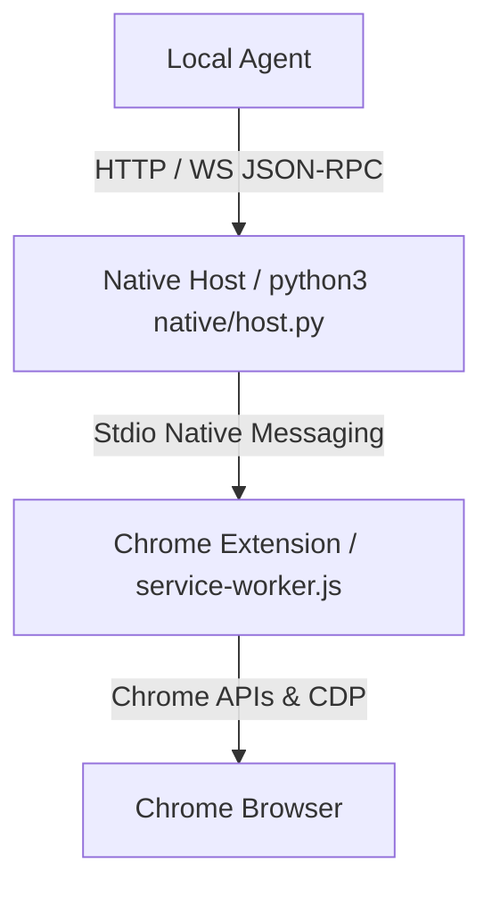

# Browser Agent Bridge

An unpacked Chrome extension plus Native Messaging host that exposes browser-control tools to a local agent through JSON-RPC over HTTP and WebSocket.

中文文档: [README.zh-CN.md](README.zh-CN.md)

## Table of Contents

- [Architecture](#architecture)
- [Features](#features)
- [Compared to CDP and Playwright](#compared-to-cdp-and-playwright)
- [Installation](#installation)
- [Authentication](#authentication)
- [Quick Start](#quick-start)
- [JSON-RPC API Summary](#json-rpc-api-summary)
- [Repository Paths](#repository-paths)
- [Security and Privacy](#security-and-privacy)

## Architecture

The extension contains no agent or model logic. It acts as a capability provider that connects local software to Chrome APIs and the Chrome DevTools Protocol.



- HTTP endpoint: `http://127.0.0.1:8765/rpc`
- WebSocket endpoint: `ws://127.0.0.1:8765/ws`

## Features

- Native Messaging integration through Chrome's stdio channel.
- Whole-browser access by default (any tab, any window), with optional tab-group isolation and a URL/method allow-deny firewall for restricting scope when needed.
- High-fidelity page interaction through Chrome DevTools Protocol.
- Page inspection with visible text, screenshots, DOM snapshots, and accessibility trees.
- Ref-based interaction: act on `ref` ids minted by `page.accessibilityTree` (`locator.*Ref`) without rebuilding a locator.
- Post-action change summaries (`whatChanged`) reporting URL, popups, focus, and optional accessibility-tree diffs.
- Event streaming for console and network activity.
- Workflow recording with input-redaction defaults.
- Optional visual overlays for tracing agent actions.

## Compared to CDP and Playwright

Playwright and the raw Chrome DevTools Protocol (CDP) are built to drive a
**dedicated, automation-launched browser**. Browser Agent Bridge instead lets an
agent operate the **user's everyday Chrome** through an installed extension. The
practical differences for an agent:

| | Browser Agent Bridge | Raw CDP | Playwright |
| :-- | :-- | :-- | :-- |
| Browser & profile | The user's running Chrome with their real profile — logged-in sessions, cookies, and extensions are already there | A Chrome launched with `--remote-debugging-port`, usually a throwaway profile | A bundled/automation Chromium with a fresh context |
| How it attaches | MV3 extension + Native Messaging host; scoped `chrome.debugger` (CDP) under the hood | An open debugging port any local process can drive | Launches or connects over CDP and owns the browser |
| Access scope | The whole browser by default — any tab, any window; `policy.set({unscopedTabAccess:false})` restores hard isolation to Agent-managed tab groups when needed | The whole browser — every tab and target | The whole browser context it controls |
| Consent & auth | Per-method runtime approval, a local bearer token, and origin checks | None — the debug port is unauthenticated | None — the test process has full control |
| Agent perception | Built-in LLM-oriented primitives: ref-tagged accessibility tree, `format: "compact"` snapshots, `page.ariaSnapshot`, and post-action `whatChanged` deltas | You read the raw protocol and build perception yourself | Locators and the DOM; you build the LLM view yourself |
| Acting | Playwright-style locators **plus** act-by-`ref` (`locator.*Ref`) on perceived nodes, and coordinate-based `computer.*` for canvas/non-DOM | Manual `Input.*` / `Runtime.*` calls | Locators with auto-waiting |
| Authenticated extraction | Reads the user's logged-in pages directly — the real session (incl. httpOnly cookies) is already present | Re-create auth: a login script or injected cookies | Re-create auth via login or `storageState` |
| Strict-CSP & payloads | Scoped per-origin CSP bypass (bounded TTL) lets injected reads/scripts run; `network.read` / `network.getResponseBody` capture XHR/JSON bodies | Drive the Network/Page domains yourself | Context-level CSP bypass; `route`/response APIs |
| Action feedback | Each action returns a `whatChanged` delta (URL, popups, focus, optional a11y diff) for the agent loop | Subscribe to protocol events and correlate them yourself | Auto-waiting plus assertions you write |
| Lifecycle | Lives with the user's browser; start/stop from the side panel | Tied to the debug session | Ephemeral context per run |

In short: Playwright and CDP are excellent for **testing and scripted automation
in a sandboxed browser**. Browser Agent Bridge is for an **agent acting inside
the user's real browser**, under an explicit tab-group boundary and per-action
approval, with perception and action primitives shaped for an LLM loop rather
than a test script.

## Installation

Prerequisites:

- Google Chrome 116 or newer.
- Python 3 installed locally.

### Install via CRX (Release)

Each release includes a pre-built `extension.crx` file. Depending on your browser, you might be able to install it directly:

1. Download `extension.crx` from the latest release.
2. Open your browser's extension management page (`chrome://extensions`, `edge://extensions`, etc.).
3. Enable **Developer mode**.
4. Drag and drop the `extension.crx` file into the page.

> [!NOTE]
> **Google Chrome and Microsoft Edge** usually block the installation of `.crx` files that are not downloaded from their official web stores. If the installation is blocked or the extension is disabled immediately, please use the **Manual installation** (Load unpacked) method below. Other Chromium-based browsers may allow it.

After installing the extension, you still need to install the Native Messaging host. Make sure to copy the extension ID after installation and proceed to step 2 in the **Manual installation** section.

### Manual installation

Use this path when you are setting up the bridge yourself.

1. Load the unpacked extension in Chrome.
   - Open `chrome://extensions`.
   - Enable Developer mode.
   - Click Load unpacked and select this repository's `extension/` directory.
   - Copy the generated extension ID, for example `lpemchcojepfkbgjgoehfknibdjjppig`.

2. Install the Native Messaging host with that extension ID.

   macOS / Linux:

   ```bash
   ./scripts/install-native-host-unix.sh <extension-id>
   ```

   For another Chromium browser, pass `--browser chromium`, `--browser brave`, `--browser edge`, or `--browser all`.

   `scripts/install-native-host-macos.sh` is kept as a compatibility entrypoint and forwards to `install-native-host-unix.sh`.

   Windows:

   ```powershell
   powershell -ExecutionPolicy Bypass -File .\scripts\install-native-host-win.ps1 <extension-id>
   ```

   This installs for the current user through `HKCU`; administrator privileges are not required.

   On macOS, the installer copies the native host runtime into `~/Library/Application Support/Browser Agent Bridge/` and points the Native Messaging manifest there. On Windows, it copies the runtime into `%LOCALAPPDATA%\Browser Agent Bridge\` and points the registry/manifest there. This keeps Native Messaging independent from the release download or extraction directory.

3. Verify the connection.
   - Reload the extension in `chrome://extensions`.
   - Open the extension side panel, accept the initial prompts, and click Start Bridge.
   - The side panel should show Connected.
   - Run `python3 scripts/doctor.py --skip-live` to verify platform-specific Native Messaging registration.

### Agent-assisted installation

Use this path when a local coding agent is setting up the bridge from this repository.

1. You still load the unpacked extension manually in Chrome:
   - Open `chrome://extensions`.
   - Enable Developer mode.
   - Load this repository's `extension/` directory.
   - The extension ID is stable because `extension/manifest.json` contains a fixed `key`.

2. Ask the agent to install the Browser Agent Bridge skill for future runs.

   For Codex-style agents, install by copying or symlinking this repository's skill directory into the agent skills directory:

   ```bash
   mkdir -p ~/.codex/skills
   ln -s "$(pwd)/skills/browser-agent-bridge" ~/.codex/skills/browser-agent-bridge
   ```

   The skill's `scripts/` directory holds **only** the portable runtime RPC clients (`rpc.sh`, `ws-rpc.js`, `browser_bridge_client.py`) so the linked skill can call the bridge on its own. It is generated by `scripts/sync-skill-scripts.sh` and gitignored — run that once to populate it before linking. Setup and diagnostic scripts (`doctor.py`, installers) are never bundled; run them from the repository's top-level `scripts/`.

   If the destination already exists, keep the existing copy only if it is current; otherwise replace it with this repository's `skills/browser-agent-bridge/` directory. This step writes outside the repository, so sandboxed agents should request elevated permission before doing it.

   Restart the agent session after installing the skill so it can discover the new `browser-agent-bridge` instructions.

3. Generate the skill's bundled runtime clients (gitignored) before linking, and re-run after those clients change:

   ```bash
   scripts/sync-skill-scripts.sh
   ```

   This injects only `rpc.sh`, `ws-rpc.js`, and `browser_bridge_client.py` into `skills/browser-agent-bridge/scripts/`. If the skill is already linked into `~/.codex/skills`, no re-copy is needed for a symlink; re-run sync if you copied it instead.

4. Ask the agent to diagnose setup from the repository root:

   ```bash
   python3 scripts/doctor.py --skip-live
   ```

5. Ask the agent to read the stable extension ID from `extension/manifest.json` before installing the native host.

   The current stable ID is:

   ```text
   lpemchcojepfkbgjgoehfknibdjjppig
   ```

   The agent can confirm it locally with:

   ```bash
   python3 - <<'PY'
import base64
import hashlib
import json
from pathlib import Path
manifest = json.loads(Path("extension/manifest.json").read_text())
pub_key_der = base64.b64decode(manifest["key"])
sha = hashlib.sha256(pub_key_der).hexdigest()
extension_id = "".join(chr(int(char, 16) + 97) for char in sha[:32])
print(extension_id)
PY
   ```

6. If the native manifest, wrapper, or token file needs repair, the agent should run the platform installer from `scripts/` with the stable extension ID.

   macOS / Linux:

   ```bash
   ./scripts/install-native-host-unix.sh lpemchcojepfkbgjgoehfknibdjjppig
   ```

   Windows:

   ```powershell
   powershell -ExecutionPolicy Bypass -File .\scripts\install-native-host-win.ps1 lpemchcojepfkbgjgoehfknibdjjppig
   ```

   These installer scripts write outside the repository, such as `~/.browser-agent-bridge.env`, browser Native Messaging manifest directories, or the Windows `HKCU` registry key. In sandboxed agent environments, the agent should request elevated permission before running them.

7. Reload the extension in `chrome://extensions`, open the side panel, allow the initial extension permission prompts, and click Start Bridge.

8. Ask the agent to verify:

   ```bash
   python3 scripts/doctor.py --skip-live
   scripts/browser_bridge_client.py health
   ```

Platform diagnostics:

- macOS: user-level Chrome, Chromium, Brave, and Edge manifest paths under `~/Library/Application Support/.../NativeMessagingHosts/`.
- Linux: user-level Chrome, Chromium, Brave, and Edge manifest paths under `~/.config/.../NativeMessagingHosts/`.
- Windows: `HKCU:\Software\Google\Chrome\NativeMessagingHosts\com.local.browser_agent_bridge` and the manifest path referenced by that key's default value.

If doctor reports `package.freshness` as a warning, the release extension directory is older than the extension source files. This does not block local unpacked-extension development; rebuild the release package before distributing.

## Authentication

Local token authentication is enabled by default to prevent unauthorized local processes from controlling the browser.

The installer generates a token file:

- macOS/Linux: `~/.browser-agent-bridge.env`
- Windows: `%USERPROFILE%\.browser-agent-bridge.env`

For shell commands on macOS/Linux:

```bash
source ~/.browser-agent-bridge.env
```

On Windows, the Python client auto-loads `%USERPROFILE%\.browser-agent-bridge.env`. For manual PowerShell calls:

```powershell
$env:BROWSER_AGENT_BRIDGE_TOKEN = (Get-Content "$env:USERPROFILE\.browser-agent-bridge.env" | Where-Object { $_ -like 'BROWSER_AGENT_BRIDGE_TOKEN=*' }).Split('=', 2)[1]
```

Authenticated HTTP and WebSocket calls must include:

```text
Authorization: Bearer <your-token>
```

## Quick Start

The easiest client is `BrowserBridgeClient` in `scripts/browser_bridge_client.py`. It auto-loads the default token file on macOS, Linux, and Windows.

### Manual use

```python
import sys
sys.path.append("./scripts")
from browser_bridge_client import BrowserBridgeClient

client = BrowserBridgeClient()

res = client.rpc("session.start", {"name": "Test Session", "url": "https://example.com"})
session_id = res["session"]["id"]
tab_id = res["tab"]["id"]

client.rpc("page.waitForLoad", {"tabId": tab_id})
text = client.rpc("page.readText", {"tabId": tab_id})
tree = client.rpc("page.accessibilityTree", {"tabId": tab_id})

client.rpc("session.stop", {"sessionId": session_id})
```

Direct HTTP example:

```bash
source ~/.browser-agent-bridge.env

curl -X POST http://127.0.0.1:8765/rpc \
  -H "Content-Type: application/json" \
  -H "Authorization: Bearer $BROWSER_AGENT_BRIDGE_TOKEN" \
  -d '{
    "jsonrpc": "2.0",
    "id": "start-session",
    "method": "session.start",
    "params": {"url": "https://example.com"}
  }'
```

Helper scripts:

```bash
python3 scripts/doctor.py
scripts/rpc.sh '{"jsonrpc":"2.0","id":"1","method":"session.start","params":{"url":"https://example.com"}}'
python3 scripts/browser_bridge_client.py health
python3 scripts/browser_bridge_client.py rpc session.get '{"sessionId":"SESSION_ID"}'
node scripts/ws-rpc.js --listen
```

### Agent use

After installation, an agent with the `browser-agent-bridge` skill installed can use the skill instructions plus the helper scripts instead of writing raw HTTP calls:

```bash
scripts/browser_bridge_client.py health
scripts/browser_bridge_client.py rpc session.start '{"url":"https://example.com"}'
scripts/browser_bridge_client.py rpc page.readText '{"tabId":123}'
```

For site-specific browsing work, the agent should:

1. Run `session.start` first to create an organizational Agent tab group (cosmetic — not a security boundary now that access is whole-browser by default), or `session.get` for an existing Agent session.
2. Prefer read-only calls such as `page.readText`, `page.accessibilityTree`, and `dom.query`.
3. Act on the `ref` ids from `page.accessibilityTree` with `locator.clickRef` / `fillRef` / `pressRef` / `hoverRef` / `selectOptionRef` instead of re-deriving selectors.
4. Use `page.executeJavaScript`, `dom.*`, or `computer.*` only when needed.
5. Respect runtime approval prompts. If the side panel is closed, the extension opens an approval popup.
6. Record reusable site selectors, waits, extraction logic, CSP needs, and pitfalls in `runtime/site-patterns/{domain}.md`.

The local HTTP/WebSocket bridge is available only while the side panel bridge control is started. If the user clicks Stop Bridge, helper scripts such as `scripts/browser_bridge_client.py health` fail until the user clicks Start Bridge again.

## JSON-RPC API Summary

| Category | Method | Description |
| :--- | :--- | :--- |
| System | `extension.info` | Get extension version and configuration. |
| System | `extension.reload` | Reload the extension background. |
| System | `native.status` | Get native host process status. |
| Tabs | `tabs.list` | List browser tabs. |
| Tabs | `tabs.create` | Create a browser tab. |
| Tabs | `tabs.activate` | Activate and focus a tab. |
| Tabs | `tabs.close` | Close tabs. |
| Session | `session.start` | Create an isolated workspace group. |
| Session | `session.list` | List active sessions. |
| Session | `session.get` | Get session details. |
| Session | `session.stop` | Close a session workspace. |
| Page | `page.navigate` | Navigate to a URL. |
| Page | `page.reload` | Reload the tab. |
| Page | `page.goBack` / `page.goForward` | History navigation. |
| Page | `page.waitForURL` | Wait for the tab URL to match. |
| Page | `page.waitForRequest` | Wait for a matching network request. |
| Page | `page.waitForResponse` | Wait for a matching network response. |
| Page | `page.waitForNetworkIdle` | Wait until network activity becomes idle. |
| Page | `page.waitForFunction` | Wait until an in-page predicate becomes truthy. |
| Page | `page.addInitScript` | Run a script before page scripts on every navigation. |
| Page | `page.waitForDialog` | Wait for a JavaScript dialog. |
| Page | `page.acceptDialog` | Accept the current JavaScript dialog. |
| Page | `page.dismissDialog` | Dismiss the current JavaScript dialog. |
| Page | `page.readText` | Extract visible page text. |
| Page | `page.accessibilityTree` | Get a structured accessibility tree; mints `ref` ids and supports `format: "compact"` for a token-lean snapshot. |
| Page | `page.ariaSnapshot` | Get a compact ARIA role/name snapshot for LLM perception. |
| Page | `page.screenshot` | Capture a page screenshot. |
| Page | `page.pdf` | Render the page to a PDF data URL. |
| Page | `page.domSnapshot` | Get a CDP DOM snapshot. |
| Page | `page.setViewport` | Emulate viewport size and device scale. |
| Page | `page.emulateMedia` | Emulate color scheme, media type, reduced motion. |
| Page | `page.setGeolocation` | Override the tab's geolocation. |
| Page | `page.setLocale` | Override locale and timezone. |
| Page | `page.setOffline` | Toggle offline network emulation. |
| Page | `page.clearEmulation` | Clear emulation overrides. |
| Page | `page.setExtraHTTPHeaders` | Add extra HTTP headers to the tab's requests. |
| Page | `page.setUserAgent` | Override the tab's user agent. |
| Interactive | `locator.allTextContents` | Extract text from all matching locators. |
| Interactive | `locator.first` | Get first/last/nth locator summaries. |
| Interactive | `expect.locator.toHaveText` | Wait for locator assertions to pass. |
| Interactive | `locator.screenshot` | Capture a screenshot of one matched element. |
| Interactive | `locator.click` | Click by selector, text, role/name, label, or placeholder. |
| Interactive | `locator.fill` | Fill fields by selector, label, or other locator fields. |
| Interactive | `locator.focus` | Focus a located element without clicking. |
| Interactive | `locator.boundingBox` | Get a located element's bounding box. |
| Interactive | `locator.press` | Focus a located element and press a key or shortcut. |
| Interactive | `locator.pressSequentially` | Focus a located element and type text key by key. |
| Interactive | `locator.check` | Check checkbox, radio, or switch-like controls. |
| Interactive | `locator.uncheck` | Uncheck checkbox or switch-like controls. |
| Interactive | `locator.selectOption` | Select native `<select>` options. |
| Interactive | `locator.clickRef` / `fillRef` / `pressRef` / `hoverRef` / `selectOptionRef` | Act on a `ref` from `page.accessibilityTree` without rebuilding a locator. |
| Interactive | `locator.setInputFiles` | Set local files on a located file input. |
| Interactive | `locator.dragTo` | Drag from one locator to another. |
| Interactive | `locator.dispatchDragDrop` | Dispatch HTML5 drag/drop events. |
| Interactive | `dom.click` | Click by CSS selector. |
| Interactive | `dom.dragTo` | Drag from one selector to another. |
| Interactive | `dom.type` | Type into a selector. |
| Interactive | `dom.setInputFiles` | Set local files on an `<input type="file">`. |
| Interactive | `computer.click` | Click at viewport coordinates. |
| Interactive | `computer.key` | Send key combinations. |
| Interactive | `computer.scroll` | Scroll by pixel offsets. |
| Interactive | `keyboard.type` | Type focused text with optional per-character delay. |
| Interactive | `keyboard.compose` | Type focused text as IME composition (CJK/accents). |
| Interactive | `keyboard.press` | Send realistic key presses and shortcuts. |
| Downloads | `downloads.waitFor` | Wait for a matching download to finish. |
| Recording | `recording.start` | Start workflow recording. |
| Recording | `recording.stop` | Stop workflow recording. |
| Trace | `trace.start` | Start lightweight RPC debug tracing. |
| Trace | `trace.export` | Export a captured trace. |
| Trace | `trace.exportHtml` | Export a trace as an HTML timeline. |

## Repository Paths

- Extension: `extension/`
- Native host: `native/host.py`
- Native manifest template: `native/com.local.browser_agent_bridge.json`
- macOS/Linux installer: `scripts/install-native-host-unix.sh`
- Legacy macOS entrypoint: `scripts/install-native-host-macos.sh`
- Windows installer: `scripts/install-native-host-win.ps1`
- Windows launcher: `native/host-wrapper.win.bat`
- Doctor: `scripts/doctor.py`
- Release builder: `scripts/build-release.sh`

## Tests

The extension is plain ES modules and the native host is stdlib-only, so there
are no dependencies to install. Run the suites directly:

```bash
node --test tests/*.mjs                                  # extension handler unit tests
python3 -m unittest discover -s tests -p 'test_*.py'     # native host tests
```

GitHub Actions (`.github/workflows/test.yml`) runs both suites plus a syntax
check on every pull request.

## Security and Privacy

- Browser tab reads and controls reach the whole browser by default — any tab, any window. `session.start` still groups the tabs it creates for visual organization, but that grouping is no longer enforced as a boundary.
- Two opt-in mechanisms narrow this scope when needed: `policy.set({unscopedTabAccess:false})` restores hard isolation to Agent-managed tab groups (calls to other tabs are rejected), and `policy.js`'s `blockedUrlPatterns`/`allowedUrlPatterns`/`blockedMethods`/`allowedMethods` act as a URL/method firewall that is always enforced independent of tab scoping — the right place for a restriction that must hold no matter which agent/client is calling. Finer-grained, per-task restrictions are expected to live in an agent-side firewall instead (planned, not yet implemented).
- Sensitive operations, plus recording data access, downloads, and policy changes, require runtime approval by default. `cookies.get` always requires approval regardless of tab scope.
- If the side panel is closed, sensitive calls trigger a Chrome notification and open an extension approval popup.
- The Native Messaging host is not started by default. Use Start Bridge in the side panel to run it, and Stop Bridge to disconnect it and pause automatic reconnects.
- Workflow recordings redact typed text by default unless `includeText: true` is explicitly used.
- `cookies.get` (read-only) can expose httpOnly session tokens, so it always requires approval (its own `cookies` category is never auto-allowed in-boundary) and redacts cookie values unless `includeValues: true`.
- The default policy blocks automation on `chrome://*`, `chrome-extension://*`, and Chrome Web Store pages.
