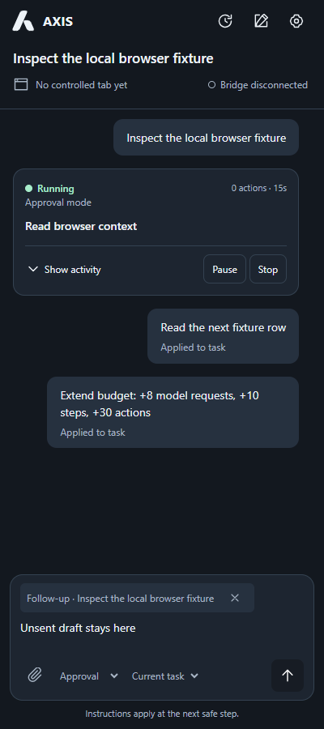
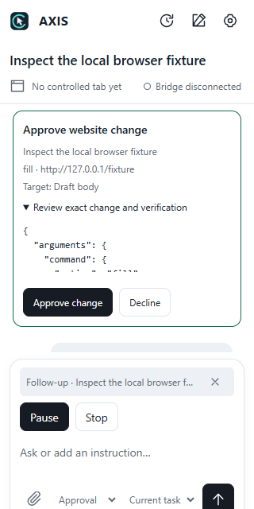

# Browser Agent Bridge

### Chrome controls for the local AXIS runtime

This directory contains the Manifest V3 extension and native messaging host that connect AXIS to an **already-open Chrome profile**. The extension provides the AXIS side panel and Settings UI. Its service worker and content scripts carry out the browser operations requested by the guarded Python runtime.

[Back to AXIS](../README.md) · [UI guide](../docs/AXIS_UI.md) · [Runtime diagram](../docs/architecture/axis-runtime.html)

## The extension at a glance

These screenshots use the local UI fixture and contain no live account data.

| Answer and activity | Workspace in dark mode |
| :---: | :---: |
|  |  |
| **Connection and settings** | **Website change approval** |
|  |  |

## Connect it

1. In `chrome://extensions`, enable **Developer mode** and load `extension/` as an unpacked extension.
2. Copy its extension ID and install the native host from this directory:

   ```powershell
   powershell -ExecutionPolicy Bypass -File .\scripts\install-native-host-win.ps1 <extension-id>
   ```

   On macOS or Linux, use `./scripts/install-native-host-unix.sh <extension-id>`.
3. Reload the extension and choose **Start bridge** in **Settings → Connection**.
4. Start `uv run python -m axis.ui_service` from `../axis-agent`, then pair the side panel with the service using its local pairing file. Follow the [full setup](../README.md#get-started) for provider configuration and pairing.

The native host listens on loopback port `8765` by default. The AXIS UI service is a separate loopback API on port `8766`; the side panel needs both connections for task execution.

## Runtime path

```text
AXIS BrowserRuntime → native host :8765 → Chrome Native Messaging
                   → extension service worker → Chrome APIs/content scripts → active tab
```

The service worker mediates browser operations; the native host forwards authenticated JSON-RPC requests. The AXIS side panel separately talks to the local UI service for messages, activity, history, and task controls. See the [high-level runtime diagram](../docs/architecture/axis-runtime.html) for boundaries and the model-provider dependency.

| Directory | Role |
| --- | --- |
| [`extension/`](extension/) | Side panel, Settings, service worker, content scripts, and packaged assets |
| [`native/`](native/) | Native messaging host and loopback bridge |
| [`scripts/`](scripts/) | Host installers and bridge utilities |
| [`tests/`](tests/) | JavaScript and Python bridge tests |

## Verify

```bash
node --test tests/*.mjs
python -m unittest discover -s tests -p "test_*.py"
```

The extension controls a signed-in browser, so grant Chrome permissions deliberately. Bridge credentials and generated runtime state stay in ignored local files.
