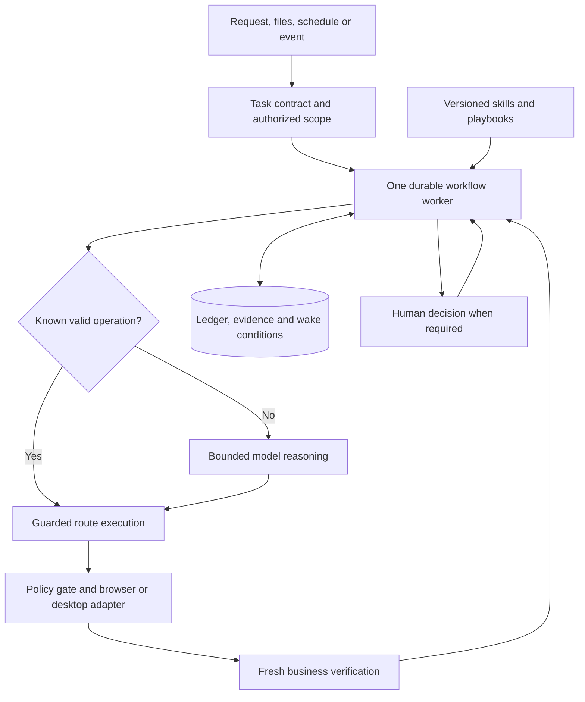

# AXIS: Enterprise Digital Worker Design Brief

**Design and market review: 11 September 2026**

**Recommendation:** Build AXIS around verified business operations, reusable application knowledge, and durable execution. Keep one worker responsible for each application session. Let deterministic code execute known operations, and call a capable model when interpretation, unfamiliar navigation, or recovery actually requires judgment.

The strongest opportunity is enterprise configuration and operational work: taking an approved specification, applying the required changes, proving the resulting state, and resuming safely after interruptions. AXIS should compete on the cost of a correctly completed workflow, including teaching and exception handling.

This brief combines a static review of the current AXIS working tree, including changes in progress, with current official product documentation. Competitor capabilities below are documented; judgments about AXIS's opportunity are design assessments. Performance improvements and roadmap thresholds are proposed targets, not measured results or claims of market leadership. No production workflows or comparative benchmarks were executed for this review.

## 1. Market Positioning and Differentiation

### Category and product identity

**AXIS is an enterprise operations worker for browser and desktop applications.** Its unit of work is a business operation with an identifiable target, authorized changes, completion conditions, and a recoverable history. Examples are “commission deployment A using workbook revision B” and “reconcile these 200 configuration records.”

The primary buyer is an operations or implementation leader who needs dependable execution without a large automation engineering team. The primary operator is an SME who can explain the application, its rules, and what a correct result looks like.

### Competitive benchmark

These categories overlap. Contemporary RPA already incorporates AI, and modern general-purpose agents already support tools, skills, and persistence. AXIS must outperform strong configurations of these products on selected workflows.

| Approach and representative products | Existing strength | What AXIS must do better on its chosen workflows |
|---|---|---|
| General computer use: OpenAI, Anthropic, Gemini | Broad visual understanding and flexible interaction. OpenAI supports programmatic UI execution; Anthropic supports ordered action batches; Gemini exposes computer-use actions and safety decisions. | Package the application-specific completion rules, recovery procedures, and operational ownership that each deployment otherwise needs to supply. [OpenAI](https://developers.openai.com/api/docs/guides/tools-computer-use), [Anthropic](https://platform.claude.com/docs/en/agents-and-tools/tool-use/computer-use-tool), [Google](https://ai.google.dev/gemini-api/docs/computer-use). |
| Browser SDKs: Stagehand with Browserbase | Combines precise actions, AI fallback, and cached actions that avoid repeated inference. Hybrid execution is already an established approach. | Reuse complete, verified business operations with scope checks and reconciliation, and reduce application onboarding and maintenance effort. [Stagehand](https://docs.stagehand.dev/v3/basics/act). |
| Browser agents: Browser Use and Skyvern | Natural-language execution; Browser Use has sessions and persistent workspaces. Skyvern documents reusable versioned agents, branching, waits, credentials, schedules, and run evidence. | Demonstrate more reliable recovery of partially committed enterprise operations and more precise document-to-application validation. These features alone do not establish a lead. [Browser Use](https://docs.browser-use.com/cloud/agent/quickstart), [Skyvern](https://www.skyvern.com/docs/cloud/getting-started/core-concepts). |
| Coding-agent browser automation: Codex and agents using Playwright | Can write reusable automation, inspect applications, use skills, and verify browser results. Codex skills already support progressive loading and reusable scripts. | Give operations users a maintained application skill, an understandable change preview, durable execution, and evidence without requiring them to manage code or agent sessions. [Codex browser](https://learn.chatgpt.com/docs/browser), [Codex skills](https://learn.chatgpt.com/docs/build-skills). |
| Traditional and agentic RPA: UiPath, Automation Anywhere, Power Automate | Deterministic execution and enterprise process integration; modern offerings also provide AI recovery and human approvals. | Win through faster SME teaching, lower maintenance, and better handling of variable operational procedures. Do not assume incumbents lack self-healing or governance. [UiPath Healing Agent](https://docs.uipath.com/agents/automation-cloud/latest/user-guide-ha/what-is-healing-agent), [Automation Anywhere](https://www.automationanywhere.com/products/agentic-process-automation-system), [Power Automate self-healing, preview](https://learn.microsoft.com/en-us/power-automate/desktop-flows/self-healing). |
| Workflow platforms: Temporal, LangGraph, n8n | Durable process execution, persisted state, or waiting and resumption, depending on the platform. These are useful infrastructure and integration options. | Own reliable interaction with the live application and proof of business completion. Integrate as an execution step when customers already have orchestration. [Temporal](https://docs.temporal.io/workflow-execution), [LangGraph](https://docs.langchain.com/oss/python/langgraph/persistence), [n8n Wait](https://docs.n8n.io/integrations/builtin/core-nodes/n8n-nodes-base.wait). |

### Where to establish a lead

Start with three closely related workflow families:

1. **Deployment configuration and commissioning:** spreadsheet values, conditional procedures, dependent forms, asynchronous jobs, final readback, and evidence packages.
2. **Operational reconciliation and bulk maintenance:** compare desired and actual records, change only discrepancies, track each row, and recover partial batches.
3. **Post-installation validation and alert response:** verify prerequisites, wait for system convergence, investigate exceptions, and execute narrowly authorized remedies.

Prefer applications with repeatable business objects, recurring work, observable results, and limited API coverage. An available, authorized bulk import or supported API may be the best way to complete a step; AXIS should use it when it preserves required semantics and auditability. Arbitrary private endpoints are not a substitute for an approved integration.

Do not initially compete on every consumer website, every desktop framework, or maximum-throughput data movement over mature APIs. Keep native desktop and remote-desktop support explicit in the product's compatibility matrix.

### Defensible value proposition

**AXIS turns an enterprise procedure and its input data into a verified, resumable operation. SMEs teach it the application's screens, business rules, and success conditions; AXIS reuses that knowledge to execute efficiently, applies judgment to exceptions, and retains evidence of what changed. Its defensible advantage is a growing library of tested application operations and recovery cases, combined with measurable reductions in manual intervention, configuration errors, and total cost per completed workflow.**

The defensibility comes from maintained operational knowledge, customer integration, and evaluation data. A planner, a navigation graph, or a self-healing selector is individually easy for competitors to reproduce.

## 2. Design Principles for a Best-in-Market Agent

| Principle | Required behavior and trade-off |
|---|---|
| Accuracy follows consequence | Spend additional checks on production, permissions, money, external communication, and destructive changes. Risk determines the evidence required; speed does not override it. |
| Known work should become inexpensive | Execute validated routes and typed field mappings locally. Reuse removes model calls but requires explicit validity checks and maintenance. |
| Observe only what the next decision needs | Prefer a fresh local predicate or scoped UI read over a full screen sent to a model. Minimize unnecessary observation, not necessary evidence. |
| Verify consequential outcomes | A click acknowledgment or a success toast is insufficient for a configuration claim. Require persisted object values or a business receipt. Verification adds latency and prevents costly false completion. |
| Uncertainty is a first-class state | Distinguish definitely failed from possibly committed. Preserve ambiguity and investigate it instead of guessing or replaying a submission. |
| State survives the worker | Store business progress, pending effects, and wake conditions outside model context. A browser and a model conversation are replaceable resources. |
| Generic capability and application knowledge stay separate | Keep browser mechanics in adapters, application semantics in skills, and task-specific order in playbooks. This avoids application branches throughout the runtime. |
| Improve through tested reuse | Turn observed successful behavior into candidate skills, then validate and promote it. One successful run is weak evidence of general reliability. |
| Human attention is a scarce resource | Ask for missing business judgment, required authorization, or unresolved effects. Honor existing scoped authorization; avoid approval on every routine click. |
| Keep one accountable execution owner | Planning and navigation can use different prompts, but share one durable task record and policy boundary. Additional agents must justify their coordination cost. |

**Optimize a constrained objective:** minimize total completion cost and elapsed execution time, subject to the required success rate and unacceptable-action limits. A cheap system that silently edits the wrong deployment is a failed product.

Reliability compounds across long procedures. As an illustration, 100 independent steps that each succeed with probability 99.5% yield only about 60.6% success for the whole sequence. Real failures are correlated, so this is not a prediction; it shows why recovery, fewer interactions, and final reconciliation matter more than a flattering per-click score.

## 3. Recommended AXIS Architecture

### Build on the existing foundation

| Current working-tree finding | Design implication |
|---|---|
| A small semantic tool surface, guarded execution, assertion-backed completion, and bounded visual fallback already exist. | Preserve these mechanisms. Extend their contracts instead of replacing the browser stack. See [agent guards](D:/Products/AXIS/Axis-phase-3/axis-agent/axis/agents.py:1). |
| Planner cadence runs every three navigator steps and can extend to six; each navigator step begins with a fresh bounded observation. | Add a deterministic route path and event-driven planning. The existing exploration path remains the fallback. See [navigator loop](D:/Products/AXIS/Axis-phase-3/axis-agent/axis/orchestrator.py:734) and [observation path](D:/Products/AXIS/Axis-phase-3/axis-agent/axis/orchestrator.py:1268). |
| Attachment workflows already persist ordered steps and predeclared assertions, and support recovery of interrupted workflows. Ordinary tasks have narrower restart support. | Generalize this ledger to all operational workflows. Add action intent, unresolved-effect states, durable waits, and reconciliation records. See [step verification](D:/Products/AXIS/Axis-phase-3/axis-agent/axis/attachments/runtime.py:143) and [recovery entry point](D:/Products/AXIS/Axis-phase-3/axis-agent/axis/ui_runner.py:262). |
| Domain-based site patterns and an existing SQLite store provide useful starting points. | Evolve site patterns into versioned application skills and reuse the store for the initial worker. See [site-pattern selection](D:/Products/AXIS/Axis-phase-3/axis-agent/browser_tools.py:858). |
| Current automatic authorization includes instruction and target-text heuristics. | Replace heuristics as the primary authority with structured, runtime-enforced scope and action effects. See [execution authorization](D:/Products/AXIS/Axis-phase-3/axis-agent/axis/execution.py:16). |
| The evaluation harness checks independent fixture outcomes, false completion, duplicate actions, latency, and usage. | Extend this harness rather than create a separate evaluation product. See [evaluation guide](D:/Products/AXIS/Axis-phase-3/axis-agent/evals/README.md). |

The attachment implementation is ahead of the main README's restart description. Treat this as a migration from partial workflow recovery, not a greenfield persistence project. The inspected execution surface is Chrome-based; browser screenshot fallback does not itself provide native desktop control.

### The smallest useful deployment

Use **one application service, one execution worker per owned session, one durable store, and versioned skill files**. A local pilot can use the existing SQLite database and local evidence files. An unattended offering needs an always-on managed host, process supervision, backups, and an application session that does not depend on a user keeping a side panel open.

Start with a small persisted wake queue and bounded worker state machine. Adopt managed durable orchestration when multi-host failover, timer volume, or process complexity justifies it; do not recreate those capabilities incrementally as a large custom framework. Temporal provides recoverable workflow execution, but external activity side effects still require application-level reconciliation. [Workflow execution](https://docs.temporal.io/workflow-execution), [activity execution](https://docs.temporal.io/activity-execution).



These are logical responsibilities, not twelve agents or microservices:

| Component | Purpose, inputs → outputs | Reasoning versus deterministic behavior | Avoiding overhead |
|---|---|---|---|
| Intake and interpretation | Request, documents, identity, policy → typed task contract, input rows, success criteria, unresolved questions. | Model interprets prose and conflicting instructions. Code parses files, validates types, pins source versions, and checks scope. | Interpret once; load exact source sections as needed. |
| Planner | Contract, skills, durable progress → milestones, dependencies, chosen operation, verification requirements. | Reason for unfamiliar tasks or changed business constraints. Instantiate an existing playbook deterministically. | Replan on meaningful events, not a fixed number of clicks. |
| Navigator | Current screen, target milestone, route map → route or bounded exploration proposal. | Deterministic route selection for known screens; model for an unknown screen or missing route. | Same model interface as planner; no independent conversation or handoff protocol. |
| Perception and resolution | Scoped DOM/accessibility data or image plus target description → screen identity, unique element, freshness and ambiguity signals. | Code resolves selectors and checks anchors. Vision or semantic reasoning handles insufficient structure. | Escalate from local predicates to scoped tree to image; avoid redundant full-page reads. |
| Action executor | Authorized action, bound values, fresh target, action ID → execution receipt or unresolved outcome. | Deterministic only. Models propose actions and never bypass this executor. | One gateway for route actions, direct tools, and visual fallback. |
| Verifier | Predeclared predicates, object identity, new evidence → passed, failed, or unknown, with proof references. | Code compares values, statuses, receipts, and counts. Model interprets genuinely semantic outputs when necessary. | Reuse suitable fresh evidence. A second model is optional, not a routine verifier. |
| State and memory | Accepted inputs, transitions, receipts, summaries → durable task state and compact model context. | Code records authoritative state. A model may summarize narrative, never rewrite completion facts. | One database; keep the full audit trail outside prompts. |
| Application-skill runtime | Application identity, tenant binding, version, role, task → validated skill subset and route contracts. | Code loads and validates; model selects among semantically plausible playbooks. | File registry and exact metadata first; load only the current screen and operation. |
| Recovery manager | Typed failure, action status, recent evidence → bounded recovery step, reconciliation, or escalation. | Code handles known transient failures. Model diagnoses novel discrepancies within the original scope. | One recovery table and shared retry budget; no retry loops at every layer. |
| Approval and escalation | Policy, exact proposed effect, evidence, prior authorization → permit, durable pause, denial, or decision packet. | Policy enforcement is deterministic. Model explains the issue or proposes alternatives. | Persist requests and release the worker; reuse still-valid authorization. |
| Monitoring and events | Wait predicates, timers, authenticated events → wake task or record unchanged state. | Code schedules, deduplicates, and evaluates ordinary thresholds. Model runs only for an actionable interpretation problem. | No model held open while waiting; no notification for unchanged state. |
| Audit and observability | Every transition, action, check, and usage receipt → evidence package, metrics, human-readable result. | Code records facts and costs. Model can narrate from those records. | Instrument the common executor and state transitions once. |

A task contract must identify the application, tenant/environment, affected objects, immutable input references, allowed effects, exclusions, completion predicates, deadline, budgets, and escalation owner. Unknown business intent blocks affected writes; it does not block unrelated read-only preparation.

Scope should include cumulative limits: maximum records changed, permitted value ranges, recipients, and allowed environments. Validate the whole proposed batch against those limits. For partial failure, define whether independent records may continue or the entire workflow must pause; dependency failures must block downstream operations.

Allow small programmatic batches and loops over the existing guarded tools so a capable model can express useful work efficiently. Enforce scope, cancellation, ownership, budgets, and result checks for every contained action. A batch must return which actions actually ran and stop at its first invalid condition; it cannot bypass guards through raw browser access. This preserves agent flexibility without writing a separate executor for every application.

For implementation, keep AXIS's existing planner and navigator definitions initially. Make them **reasoning modes under one worker**, with a deterministic fast path between them. Do not require a full rewrite to get the benefits of one execution owner.

## 4. Navigation and UI Interaction Strategy

### Identify the screen before choosing the route

Maintain a screen identity comprising application, origin, route family, tenant/environment, user role, selected object, active modal/tab, and several stable anchors. URLs identify context but rarely prove the selected tenant or record. Include breadcrumbs and headings where available.

Separate two concepts:

- **Structural fingerprint:** screen type, stable anchors, relevant component shape, application version, and locale. Ignore changing timestamps, generated element references, and ordinary row values.
- **Live business state:** target record, current field values, pending changes, job status, and permissions. Read these freshly when they affect an action or completion claim.

A fingerprint is a cache validity signal, not proof that the intended object is selected. Cached understanding should answer “how this screen works”; fresh evidence answers “what is true now.”

### Practical targeting hierarchy

Use the most reliable available method for the particular application:

1. **Maintained explicit UI contracts:** stable test IDs, documented element IDs, or native automation identifiers, combined with live screen and object guards.
2. **Unique semantic locators:** role and accessible name, field label, or an application-supported automation property, scoped to the correct form, dialog, or record.
3. **Scoped structural targeting:** row business key plus column header; short stable attributes; explicit frame or shadow-root context.
4. **A fresh observation reference:** a currently resolved element from the accessibility or DOM snapshot, invalidated when its relevant UI state changes.
5. **Agentic semantic resolution:** interpret a scoped tree, compare candidates, and obtain another observation if the target remains ambiguous.
6. **Visual fallback:** fresh screenshot, visual/OCR grounding, target-region inspection, then a bounded coordinate action and verification.

Avoid arbitrary positional selectors, remembered coordinates, and “click the first match.” A unique selector still needs business-context validation. Apply native actionability checks and waits rather than reproducing them in prompts. Playwright documents fresh locator resolution and visibility, stability, event-reception, and enabled-state checks. [Locators](https://playwright.dev/docs/locators), [actionability](https://playwright.dev/docs/actionability).

For native Windows applications, add an adapter that uses the platform accessibility/automation tree before vision. For Citrix, canvas, or image-only interfaces, explicitly use a visual path with tighter verification and supported display settings. Publish which interaction methods each application supports.

### Routes and component behavior

Represent screen maps as small adjacency lists. Each route edge has preconditions, actions, exit conditions, permission requirements, and observed cost/failure history. Select a low-cost valid route using estimated latency and failure cost, rather than minimum clicks alone. Store learned timings; start with simple weights.

Use documented deep links when they reliably preserve session and application semantics. Do not construct state-changing URLs or skip mandatory wizard stages. Cache menu routes as alternatives.

| UI pattern | Execution strategy |
|---|---|
| Tables and pagination | Filter/search by business key; identify rows by key and columns by header. Record processed keys and page cursors. Handle virtualization explicitly and reconcile total expected rows. |
| Forms | Bind typed inputs once; follow field dependencies; use explicit set/check/uncheck operations. Read final critical values and validation errors before commit. Treat autosave fields as consequential writes. |
| Dialogs | Scope every target to the active dialog and verify its purpose. Stop a batch when a new modal appears. |
| Tabs, frames, and windows | Preserve task-owned handles while live; reacquire after restart. Bind actions to explicit context, never whichever tab is accidentally focused. |
| Dynamic components | Wait on the relevant condition, such as an enabled option or completed job. Avoid fixed sleeps and whole-page network-idle assumptions. |
| Uploads and downloads | Verify the selected file's identity before upload and the application's receipt afterward. Verify completed downloads and content or checksum when required. |

**Batch only within a known safety boundary.** Filling several independent non-autosaving fields can use one local routine with per-field checks. Stop on changed dependencies, unexpected navigation, a validation error, or an approval boundary. Keep Save/Submit as a separately journaled consequential action. Return compact structured results instead of one model turn per field.

After every consequential action, use fresh evidence tied to that operation. After a navigation-only action, the destination's identity check can serve as the verification and the next step's precondition.

On mismatch: refresh the relevant state once, re-resolve known anchors, try an alternate validated route, then use bounded semantic or visual exploration. If two controls remain plausible, do not guess. Quarantine the affected route when anchors, field meanings, permissions, or outcome predicates have materially changed.

## 5. Application Skill Framework

### Three reusable layers

| Layer | Contents | Boundary |
|---|---|---|
| Generic capability | Read a labeled form, find a keyed table row, wait for a job, upload a file, collect evidence. | Knows interaction mechanics, not a particular application's business meaning. |
| Application skill | Authentication behavior, screen graph, controls, business objects, rules, supported versions, failure patterns, and safe recovery. | Knows the application, not a customer's current task values or authority. |
| Workflow playbook | Commission a deployment, update a record set, validate installation, investigate an alert. | Defines operation order, dependencies, mappings, approvals, and completion conditions using application capabilities. |

Use a **Markdown guide plus schema-validated YAML**, with optional reviewed helper scripts. Markdown holds rationale and unusual cases. YAML holds identifiers, typed mappings, guards, action parameters, and verification predicates. Do not turn prose into an enormous executable language. Reuse existing AXIS command and assertion types, adding only the missing business-operation fields.

Progressive loading is useful but not differentiated by itself: Codex already loads skill metadata before full instructions. AXIS should add tested operational contracts and compatibility checks. [Official skills documentation](https://learn.chatgpt.com/docs/build-skills).

Suggested package layout, illustrative rather than an existing repository directory:

```text
application-skill/
  SKILL.md                 # Purpose, scope, business meaning, navigation guidance
  manifest.yaml            # Identity, owner, version, roles, compatibility
  screens.yaml             # Screen identifiers, anchors, routes, controls
  operations.yaml          # Preconditions, effects, checks, reconciliation
  playbooks/commission.yaml
  mappings/configuration.yaml
  references/              # Reviewed procedures and source versions
  fixtures/                # Sanitized known screens and regression cases
  helpers/                 # Optional reviewed routines using the guarded adapter
```

Small applications can combine the YAML sections in one file. Split files for maintainability, not because a framework requires them.

### Minimum skill contents

- **Identity:** application purpose, exact approved origins, supported versions/locales, owner, review date, role requirements, and tenant-binding method.
- **Sessions:** sign-in and SSO routes, indicators of a valid session, timeout behavior, supported reauthentication, and MFA handoff.
- **Navigation:** screen map, anchors, menu paths, deep links, route alternatives, dialogs, tabs, frames, and dynamic components.
- **Data:** fields, labels, units, enum values, lengths, dependencies, blank-versus-null semantics, and Excel column-to-field mappings.
- **Business operations:** prerequisites, allowable changes, expected responses, completion checks, known failures, reconciliation queries, compensation, and retry limits.
- **Governance:** risk classes, applicable approval policy references, evidence requirements, supported data classification, and change history.

An illustrative operation contract:

```yaml
id: deployment.set_timeout
skill_version: 1.2.0
screen: deployment.settings
object_key: [tenant_id, deployment_id]
input:
  timeout_seconds: {type: integer, minimum: 1, maximum: 3600}
guards:
  - environment_matches_task
  - deployment_id_matches_task
  - settings_form_unique
effect: update_configuration
target_state: {timeout_seconds: "${input.timeout_seconds}"}
prepare_route: fill_timeout_without_commit
commit_action: save_settings
verify:
  - reopen_deployment_settings
  - persisted_timeout_equals_input
  - no_validation_errors
reconcile:
  read: current_persisted_timeout
  desired_value: record_goal_satisfied
  previous_value: retry_only_after_commit_is_proven_absent
  other_or_unknown: pause_for_review
approval_policy: production_configuration
evidence: [object_identity, before_value, persisted_after_value]
```

The symbolic guards and routes refer to reviewed runtime operations. They are not instructions to execute arbitrary code. If the system exposes no reliable way to prove an absent commit, the stated retry condition cannot pass.

### Authoring, selection, and maintenance

An SME demonstrates one representative workflow or provides a procedure and screen map. AXIS drafts the screen definitions, mappings, and success conditions. A maintainer validates normal behavior, an important exception, and recovery before publishing the skill. Measure teaching time and subsequent maintenance time separately.

For Excel-driven configuration, preserve workbook hash, sheet, row/cell, formula or cached-value status, and source revision. Validate headers, types, units, dates, duplicate keys, and dependencies before touching the application. Missing or stale formula results require a trusted recalculation or clarified input. Do not infer production values from display formatting or a semantically similar document passage. The current attachment parser already exposes important provenance and formula limitations; retain that behavior. [Attachment documentation](D:/Products/AXIS/Axis-phase-3/axis-agent/axis/attachments/README.md).

Select skills by exact application/tenant binding, allowed origin, installed version, locale, role, and task category. Use semantic search only to find candidates; confirm their identity and live screen guards before execution. A wildcard hostname match alone is too weak for a production write.

Pin skill and playbook versions per workflow. Revalidate critical guards on use and after a long pause. If a UI revision changes appearance but preserves semantics, AXIS can propose a selector or route repair. If units, business meaning, permissions, or verification change, pause the affected operation and require review.

Use the lifecycle **draft → validated → published → degraded → retired**. A failed route can degrade without disabling unrelated routes. A repair proposal includes before/after observations, the failing guard, proposed change, affected versions, and regression evidence. Promotion requires review; an active workflow may use a bounded recovery within its existing scope, but it does not silently publish a new global skill.

Never let a learned skill widen authority, remove approval requirements, or weaken a saved postcondition. Keep customer values, credentials, and sensitive screenshots out of shared skill packages. Cross-customer reuse requires permission and sanitization.

## 6. Long-Running Workflow Model

### Lifecycle and durable state

Use a workflow lifecycle of:

**Created → Validating → Ready → Running → Verifying → Completed**

Running or Verifying can transition to **Waiting**, **Awaiting approval**, **Needs input**, or **Recovering**. Recovery returns to the relevant operation after reconciliation. Terminal outcomes also include **Failed**, **Cancelled**, and **Stopped safely with unresolved effects**. Store the reason separately from the state.

Keep business-operation state separately:

**Pending → Prepared → Effect pending → Verified**

An operation whose effect cannot be established enters **Outcome unknown**. An operation may also be **Already satisfied**, **Failed**, **Compensated**, or **Skipped with an approved reason**. A method returning successfully does not make an operation Verified.

Persist the task contract and its revision, input hashes, operation keys, approved plan, before/desired values, frozen postconditions, action/attempt IDs, execution receipts, evidence references, session binding, budgets, pending approvals, retry history, wait conditions, and the next wake time. Keep completion records outside bounded model memory so context compaction cannot erase them.

### Commit and recovery protocol

For each consequential operation:

1. Read the current object and validate identity, scope, and relevant preconditions.
2. Compute the desired change. If already satisfied, record a fresh no-change verification.
3. Persist the prepared operation and exact approval binding, if required.
4. Immediately before dispatch, recheck live guards and persist the action intent. The effect is now potentially pending.
5. Execute through the guarded adapter, then persist its receipt.
6. Read back the business result and record Verified only when the saved postconditions pass.

On restart, an action with persisted intent and no definitive result must be reconciled. AXIS cannot atomically commit its database transaction and a third-party UI submission. **Exactly-once external effects are not generally achievable through arbitrary GUIs.** A local idempotency key prevents duplicate AXIS dispatch records; it cannot make an external form idempotent.

Prefer idempotent “set value to X” operations to toggles or increments. For create/send/submit operations, use an application-supported external reference, transaction receipt, or searchable natural key when available. Preserve one logical operation key across recovery, with separate attempt IDs.

If a Save times out, reopen the exact object and inspect persisted state. Desired state may establish that the task goal is satisfied without proving AXIS caused the change; record that distinction. Previous state alone may not prove failure while a request is still processing. Account for the application's consistency window or job status before retrying. If attribution or absence remains unknowable, escalate without another submission.

### Sessions, waits, and external dependencies

Short UI waits use bounded local predicates. For longer waits, persist the condition, deadline, next check, and backoff; release model context and compute resources. Keep a browser alive only when its session or unsaved state is genuinely needed. Unattended execution requires an available managed worker even if the user's laptop sleeps.

Prefer authenticated application events or approved status APIs where available, otherwise schedule targeted UI reads. Recheck at a cadence derived from the workflow's response-time requirement. Use capped backoff and jitter, a maximum lateness limit, and event deduplication. A missing dashboard update is not evidence that no alert exists; track data freshness and monitor health.

Treat authentication as explicit state. Detect login redirects and expired-session indicators, reauthenticate through an approved method, then recheck tenant, role, object, and the pending operation. MFA and CAPTCHA can require a human; persist the pause and a timeout rather than attempting a bypass. Do not keep sessions alive against application policy.

An approval wait stores the decision request and releases the worker. On return, check the decision's identity, expiry, scope, input hash, and current application state. Changes to the proposed effect invalidate approval. A cosmetic UI change does not automatically invalidate business authorization if the same effect can still be safely established.

### Ownership, handoff, and failure handling

Use one writer per browser session and lock conflicting business objects across workflows. Record a renewable execution lease and generation number. The action gateway rejects stale generations. Do not hand a session to another worker until old in-flight actions have settled or the old session has been isolated and pending effects reconciled; database locking alone cannot cancel an external request already sent.

For browser crashes, reconstruct the session and navigate by application and business identity, not saved tab IDs. For network loss, classify the in-flight action's effect as unknown. For partial batches, resume from the per-record ledger; never restart the complete spreadsheet blindly.

A human takeover pauses automated writes, revokes the active execution lease, and records the handoff. On return, take fresh observations and reconcile affected records. Safe cancellation prevents new dispatches, waits for or quarantines in-flight actions, and reports possible outstanding effects. Closing a browser cannot undo a submitted request.

Monitoring uses persistent subscriptions with independent incident records. Deduplicate by alert identity and state transition, apply hysteresis where thresholds fluctuate, and limit repeat responses. Notify on meaningful changes, monitor failure, completion, or required intervention. External email/notification delivery uses the same authorization, action ledger, and receipt handling as UI changes.

## 7. Cost, Latency, and Efficiency Design

### Optimize completion economics

Track:

**Cost per verified completion = (model + browser/worker + storage + human intervention + allocated teaching/maintenance + failed-attempt/remediation costs) ÷ independently verified completed workflows.**

Report model-only cost separately. Break latency into agent execution, application wait, queue wait, and human wait; otherwise a slow enterprise backend can hide an efficient agent or make an agent look unnecessarily slow.

| Major cost or latency source | Recommended reduction | Reliability constraint |
|---|---|---|
| Screenshots and large observations | Local predicates, scoped trees, image crops, event-driven invalidation. | Respect provider tool-result requirements; preserve enough context to identify the target safely. |
| Repeated model reasoning | Execute known route segments locally; reason at decisions and exceptions. | Stop the segment when any guard fails. |
| Long prompts and histories | Stable cached instruction prefixes; compact task summaries; selected source ranges and recent evidence. | Authoritative ledger and exact inputs remain durable outside context. |
| Inefficient navigation | Reuse validated routes, search/filter by object key, use supported deep links or imports. | Preserve prerequisites, business semantics, and approval boundaries. |
| Ambiguous elements | Application-specific anchors and scoped semantic locators. | Never resolve ambiguity by selecting the first candidate. |
| Repeated retries | One retry owner, typed errors, progress detection, and a shared budget. | Unknown effects trigger reconciliation, not retries. |
| Excessive verification | Combine destination check and next precondition; batch readback of fields or rows when trustworthy. | Every consequential result must remain covered; sampling cannot prove that all rows are correct. |
| Replanning known workflows | Instantiate a playbook and retain remaining milestones. | Replan for changed goals, failed invariants, or new dependencies. |

Use three execution levels: **no-model deterministic execution**, **economical reasoning for calibrated low-risk ambiguity**, and **strong reasoning for unfamiliar or difficult work**. For high-risk semantic decisions, route directly to a validated stronger model or a human; a failed cheap attempt can cost more than starting with the right model.

Do not choose a model from price or self-reported confidence alone. Evaluate completed workflows with the actual tool interface, language, application, and error cases. Keep the current provider abstraction and initially add at most two reasoning configurations. Multiple providers and elaborate routing are later options, not prerequisites.

### Explicit decision policy

| Decision | Trigger | Boundary |
|---|---|---|
| Observe | Required fact missing/stale; relevant screen change; resume; precommit context check; verification due. | Use the smallest sufficient fresh read. An unchanged screenshot cache is never current business evidence. |
| Reason | No valid route; ambiguous business interpretation or target; conflicting evidence; novel error. | Supply the current operation, relevant skill, compact state, and exact evidence. |
| Act | Authorized scope, unique target, valid preconditions, retry-safe state, and remaining budget. | Record consequential intent first; run all paths through the same gate. |
| Verify | Consequential action dispatched; asynchronous result becomes available; milestone completes. | Use the frozen business predicate, fresh object identity, and suitable evidence. |
| Retry | A recoverable failure is confirmed to have had no effect, or the operation is proven idempotent under current conditions. | Start with one local repair and one alternative attempt per operation; tune using data. Never retry an unresolved commit. |
| Replan | Route invalidated, repeated no progress, failed business prerequisite, or changed task constraints. | Preserve completed operations, authorizations, and unresolved effects. |
| Escalate | Missing business decision, required approval/MFA, unresolved commit, persistent identity conflict, or recovery budget exhausted. | Provide one actionable packet: what is known, what is uncertain, and the decision needed. |
| Stop safely | Cancellation, denied policy, deadline or budget exceeded, revoked access, or evidence too weak to proceed. | Persist progress and unresolved effects; never label an incomplete workflow completed. |

A stronger model may propose a recovery but cannot override a policy denial. New information should justify each additional attempt. Two equivalent attempts with no new evidence should end that strategy.

**Illustrative target:** a 20-field known form can be one parameterized fill routine, a separate journaled commit, and a readback routine, with no model call per field. Browser interactions still occur and critical values still get checked. Measure the actual reduction; do not advertise an assumed percentage from this example.

## 8. Reliability, Safety, and Enterprise Controls

### Evidence-based confidence and action risk

Avoid a single model-generated “97% confidence.” Track separate signals: application/object identity, locator uniqueness, observation freshness, input validity, skill compatibility, and outcome evidence. Calibrate failure rates on held-out runs by action type. A hard identity or authorization failure cannot be averaged away by other high scores.

| Risk class | Examples | Default control |
|---|---|---|
| R0: read/navigation | Read a dashboard, open a record. | Permit within scope; check destination and data freshness. |
| R1: reversible preparation | Populate a non-autosaving draft. | Permit within existing authorization; validate fields and preserve a clear commit boundary. |
| R2: consequential business change | Save configuration, upload sensitive material, send an authorized notification. | Exact effect binding, persisted intent, strong readback, and approval only when tenant policy or missing authorization requires it. |
| R3: destructive or especially sensitive | Delete records, change privileged access, perform irreversible actions. | Explicit scoped approval, strict identity checks, and recovery/compensation review. Disallow unsupported cases. |

Classify **effects**, not mouse events. Pressing Enter, visiting an action URL, or editing an autosave field may be a consequential action. Moving a slider is not intrinsically safe because it is a “drag.”

### Minimum enterprise controls

| Control | Minimal high-value implementation |
|---|---|
| Authorization and roles | Tenant-scoped operator, approver, skill-maintainer, and administrator roles. Intersect task scope with tenant policy, application account permissions, and adapter capabilities. Enforce outside the model. |
| Credential handling | Use vault or OS credential references; inject values through the executor. Keep passwords, cookies, tokens, and raw session state out of prompts, trace arguments, and shared skills. Encrypt reusable profiles. |
| Isolation | Use a dedicated work profile or managed desktop for unattended tasks. Separate tenants and workers; restrict origins, downloads, uploads, filesystem access, and network destinations. |
| Approval binding | Bind approval to tenant, actor, object set, exact proposed change, input/plan revision, and expiry. Revalidate before dispatch; audit decisions. |
| Prompt-injection resistance | Treat pages, screenshots, attachments, retrieved text, and tool output as untrusted data. They cannot expand task authority or change policy. Validate outgoing recipients, destinations, files, and effects independently. |
| Audit trail | Record state transitions, plan/skill versions, action IDs, masked parameters, timestamps, actor/lease, receipts, checks, and costs. Use append-only records with restricted write access; add stronger retention guarantees when required. |
| Evidence and privacy | Store required before/after values, object identity, receipt IDs, and selected screenshots. Redact before model transmission and persistence; keep originals only under explicit restricted evidence policy. Apply retention and deletion rules. |
| Dry run | Perform authorized reads, validate mappings, compute proposed differences, and stop before external effects. Preview cannot prove a future submission will succeed. Use sandbox fixtures for execution simulation. |
| Compensation | Record before values and a reviewed compensating operation where supported. Recheck current state and authorization before compensation so another user's later change is not overwritten. |
| Operator controls | Pause, safe stop, approve, take over, resume, and view evidence. A blocked task should say exactly what decision is needed. |

Define completion strength explicitly: **interaction executed**, **application accepted**, **persisted business state verified**, and, when required, **downstream operational effect verified**. Commissioning may require all four. A submitted job is not a completed deployment.

Store root-cause information as a concise structured record: failed operation, expected versus observed state, relevant source/skill versions, action effect status, attempts, evidence, and recommended next action. Use categories such as input error, application validation, UI drift, expired session, transport failure, policy denial, or unresolved commit. If the cause is uncertain, say so.

Generate the final human-readable summary from the ledger: requested objects, verified changes, unchanged objects, skipped items and reasons, failures, unresolved effects, evidence links, and required follow-up. Avoid retaining private model reasoning as an audit requirement; record decisions and evidence that an operator can inspect.

## 9. Breakthrough Opportunities

These are practical product opportunities, not claims that their individual techniques are new. Their value comes from integrating them around enterprise business outcomes and proving that integration works.

### 1. Desired-state configuration execution

**Problem:** Replaying a procedure can overwrite correct configuration, repeat work, or duplicate records.

**Competitive challenge:** Click scripts and free-form agents need application-specific semantics to distinguish “already correct” from “must perform the recorded action.” RPA can implement this, but each operation needs careful authoring.

**AXIS implementation:** Convert inputs into a typed desired-state manifest, read actual state, produce a change preview, and execute only differences. Track each object and field with a business key. Verify the final manifest, including unchanged records.

**Expected impact:** Fewer actions and easier reruns, with fewer accidental duplicate effects. Benefit grows when many records are already correct.

**Complexity:** Medium; start with one application's configuration objects. **Priority: P0.**

### 2. Application route reuse with live guards

**Problem:** Agents repeatedly rediscover navigation and form mechanics; bare replay can silently target a changed UI.

**Competitive challenge:** Cached actions already exist. The harder requirement is deciding whether the entire operation remains valid for this tenant, role, object, and version.

**AXIS implementation:** Store small screen graphs and route contracts. Execute a guarded route without a model; stop locally on mismatch; explore only the missing segment. Record completion, timing, and failure data per route version.

**Expected impact:** Lower model usage and navigation latency on repeated work while preserving a flexible fallback.

**Complexity:** Low–medium. **Priority: P0.**

### 3. Outcome-aware recovery ledger

**Problem:** The application commits a change but the worker crashes before receiving confirmation.

**Competitive challenge:** Durable process engines preserve their own state; cached UI scripts preserve actions. Neither automatically establishes whether an arbitrary external GUI committed an effect.

**AXIS implementation:** Persist intent, before/desired values, a reconciliation method, and frozen postconditions. On recovery, investigate the exact business object before any repeat action. Maintain unknown outcomes explicitly.

**Expected impact:** Safer restarts, fewer duplicates, and less manual reconstruction after outages. Some ambiguous operations will correctly require a human.

**Complexity:** Medium–high, with high testing importance. **Priority: P0; essential before unattended consequential work.**

### 4. Input-to-outcome evidence lineage

**Problem:** An operator cannot explain which workbook cell caused a change or whether every requested item was applied.

**Competitive challenge:** Screenshots and action logs do not automatically connect source requirements to persisted application state.

**AXIS implementation:** Link source hash and cell/section → typed value → operation → object identity → before/after evidence. Generate a compact coverage report and exception list automatically. Extend AXIS's existing attachment provenance and assertions.

**Expected impact:** Faster review and diagnosis, stronger completeness checks, and less manual evidence preparation.

**Complexity:** Medium. **Priority: P0.**

### 5. Teaching from SME demonstrations with controlled repair suggestions

**Problem:** Application onboarding is expensive, and UI changes gradually erode automation reliability.

**Competitive challenge:** Self-healing selectors cannot by themselves determine whether a business rule or field meaning changed. Automatically promoting a repair can spread a mistake.

**AXIS implementation:** Use an SME demonstration plus a procedure to draft a skill. Capture anchors, mappings, and intended results. Generate a focused repair proposal from failures, validate against sanitized fixtures and a canary environment, then publish a reviewed version.

**Expected impact:** Lower teaching and maintenance effort and faster recovery from benign UI drift. Measure how much human review it still needs.

**Complexity:** Medium. **Priority: P1.**

### 6. Adaptive observation tied to business state

**Problem:** A full screenshot/model loop runs even when only one status label matters.

**Competitive challenge:** General agents often receive broad observations because they lack a trusted model of the current application operation. A naive cache can miss changes.

**AXIS implementation:** A skill declares relevant anchors and wait predicates. The worker checks those locally, sends deltas when sufficient, and expands to a scoped tree or screenshot on change or ambiguity. Invalidate on relevant navigation, modal, identity, viewport, or dependency changes.

**Expected impact:** Lower observation tokens, fewer redundant reasoning calls, and cheaper monitoring.

**Complexity:** Low–medium initially; avoid building a universal DOM-diff system. **Priority: P1.**

### 7. Small, targeted enterprise failure corpus

**Problem:** A polished demo gives little evidence about ten-hour workflows with interruptions and partial results.

**Competitive challenge:** Generic interaction benchmarks do not establish application-specific completion, no-duplicate recovery, or teaching economics.

**AXIS implementation:** Extend the existing evaluation fixtures with recorded, sanitized enterprise failure patterns and fault injection at action boundaries. Every promoted skill must pass its normal and recovery cases. Use production incidents to add regression cases, with permission and redaction.

**Expected impact:** Faster detection of regressions, better model/route selection, and a defensible evidence base for product claims.

**Complexity:** Low–medium for the first corpus; ongoing curation required. **Priority: P0.**

## 10. Phased Product Roadmap

The roadmap is ordered by evidence and dependency, not calendar promises. All numeric targets below are provisional acceptance goals to validate with pilots.

| Phase | Scope and key capabilities | Why it matters | Difficulty and dependencies | Success metrics | Risks to avoid |
|---|---|---|---|---|---|
| **1. Immediate: highest impact, low complexity** | Baseline current behavior; select one commissioning workflow; introduce a minimal application skill and a few guarded routes; use typed mappings; reduce routine planner calls; attach cost and outcome metrics to operations. | Proves the architecture can improve efficiency while keeping existing safeguards. | Low–medium. Reuses browser guards, attachment parsing, assertions, SQLite, and evaluation fixtures. Needs an SME and a representative test application. | Target ≥30% fewer model requests on the selected known workflow with no observed success regression; every write has a declared outcome; report false completions and duplicates independently. | Full runtime rewrite; optimizing tokens without correctness; hardcoding one demo; treating a percentage target as an achieved result. |
| **2. Near-term: reliable enterprise deployment** | Generalize the workflow ledger; add pending/unknown effects and reconciliation; durable waits and approvals; managed unattended worker; scoped credentials; session recovery; per-object conflict control; privacy and evidence retention. | Makes hours-to-days execution and recovery operationally credible. | Medium–high. Requires operation contracts, a reliable session host, credential integration, and fault-injection tests. Use a maintained scheduler/queue component and keep state transitions small. | Every supported crash boundary reconciles safely in tests; no duplicate or unauthorized effects in the release suite; a 24-hour and a 72-hour workflow resume correctly; monitor/check lateness meets the declared SLA. | Calling history persistence “durability”; retries across unknown effects; relying on a sleeping laptop; broad personal-profile access. |
| **3. Differentiation: establish a measured lead** | Desired-state execution across several applications; source-to-outcome evidence reports; SME teaching; reviewed skill repair; risk-aware model selection; authenticated external events; selected native desktop adapter. | Produces reusable operational expertise and better completion economics across customers. | Medium–high. Needs stable contracts, representative pilot volume, trusted reviewers, and held-out evaluation cases. Native support needs its own compatibility and recovery tests. | Proposed target ≥98% verified success on the supported, known-workflow suite; ≥30% lower fully allocated completion cost versus the strongest relevant baseline at matched reliability; lower teaching and maintenance hours. Report confidence intervals and cold-start results separately. | Calling caching unique; hiding human work; comparing warm AXIS skills with unprepared competitors; expanding app coverage before maintenance is sustainable. |
| **4. Long-term: pursue after the foundation is proven** | Multi-host scheduling and failover through mature infrastructure; broader desktop/remote interfaces; certified third-party skill packages; specialized small models where justified; carefully bounded cross-application concurrency. | Expands coverage and throughput after the unit economics and controls work. | High. Requires multi-tenant operations, sufficient evaluation data, signed skill distribution, and clear provider/data policies. | Sustained reliability under load and failover; predictable cost at higher volume; native coverage targets met; skill maintenance effort grows slower than supported workflow volume. | Training a foundation model prematurely; unrestricted multi-agent swarms; autonomous global skill changes; building a large orchestration platform without demand. |

### How to demonstrate that AXIS is better

**Benchmark the workflow, not the click.** Extend the existing AXIS harness with real application sandboxes and independently observable outcomes.

Use three comparison lanes:

1. **Architecture comparison:** current AXIS versus the redesigned worker, using the same model, application versions, inputs, and budgets. Ablate routes, observation policy, and recovery separately to identify the source of improvement.
2. **Product comparison:** strongest practical general/browser agent setup and an SME-authored RPA or hybrid baseline. Provide equivalent procedures and allowed preparation time. Record all teaching, configuration, and maintenance effort.
3. **Production economics:** allow each system its approved APIs, imports, and integrations. Report this separately from a UI-only comparison, because the available action surface changes the task.

An initial suite should include at least 30 representative workflows across three enterprise applications, repeated with varied inputs and UI conditions. Add native workflows when the adapter exists. Treat this as a starting dataset, not enough evidence for extremely low failure-rate claims. Use held-out task variants, application versions, and previously unseen screens. Evaluate cold runs, warm skill-assisted runs, and recovery runs separately.

Measure:

- **Verified workflow success:** all mandatory business outcomes satisfied within scope and deadline, checked independently of the agent's own completion message.
- **False completion:** completed reports whose independent checks fail.
- **Harmful or unauthorized effects:** wrong object/environment, unwanted communication, duplicate writes, or policy violations, even if the workflow otherwise completes.
- **Recovery:** correct continuation after each supported interruption, including unresolved cases escalated appropriately. Track autonomous recovery and safe escalation separately.
- **Efficiency:** total and model-only cost, model calls, browser actions, redundant observations, active execution time, p50/p95 latency, and wait-time breakdown.
- **Operational burden:** teaching time, maintenance time, intervention frequency and minutes, evidence-review time, and unresolved-task age.

Inject failures around commit boundaries: crash before dispatch, response lost after commit, delayed commit, session expiry, browser restart, duplicate wake delivery, stale approval, changed tenant, reordered/virtualized tables, renamed controls, misleading success text, conflicting manual edits, and multi-step partial completion. Test cancellation and human takeover while an action is in flight.

Use application database/fixture state or an authorized independent read as the oracle where possible. If only UI verification exists, document its blind spots. An independent model judge can help evaluate semantic quality but should not replace objective checks for records, amounts, identifiers, or duplicate actions.

Publish run counts and uncertainty by workflow family. Repeated runs of one easy task do not establish cross-application reliability. Zero observed harmful actions is a release gate, not proof of zero risk. For intuition, with zero failures in 1,000 independent trials, the approximate one-sided 95% upper failure-rate bound is still 0.3%; correlated enterprise tasks weaken that inference further.

The release decision should require both safety gates and improved completion economics. Do not trade a higher false-completion rate for fewer model calls.

### Build, reuse, defer

**Build:** application operation contracts, live skill guards, effect reconciliation, input-to-outcome lineage, and the enterprise evaluation corpus.

**Reuse:** the existing guarded browser adapter, typed models, file parsing, SQLite pilot store, telemetry, mature credential stores, and maintained scheduling/durable-execution infrastructure when required.

**Defer:** a graph database, a new vector service, per-component agents, a custom workflow language, unrestricted code execution, automatic global skill promotion, foundation-model training, and a second orchestration framework layered over the first.

## 11. Final Recommendation: The AXIS Operating Model

1. **Accept an operational contract.** A user request, file, schedule, or authenticated event identifies the desired result, application, environment, objects, limits, and allowed effects. AXIS validates input provenance and resolves only material gaps.
2. **Bind knowledge and plan.** Select and pin compatible application skills. Instantiate a known playbook, or use bounded reasoning to create milestones with explicit completion conditions.
3. **Read and compare.** Identify the live application state and exact business object. For configuration work, calculate differences between desired and actual values.
4. **Navigate by reusable routes.** Execute validated routes with local guards and scoped observations. Use the model to resolve unfamiliar states or route failures.
5. **Prepare, authorize, act, verify.** Journal consequential intent, honor existing scope and required approvals, perform the action through one gate, and prove the business result with fresh evidence.
6. **Recover from facts.** On failure, classify the effect, reconcile the object, and retry only when safe. Preserve uncertainty and ask a human when the application cannot establish the result.
7. **Pause without forgetting.** Persist waits, approvals, source versions, completed records, unresolved effects, and budgets. Release compute and resume on a scheduled check or event with a fresh session and valid ownership.
8. **Improve through reviewed evidence.** Produce a source-linked completion report, measure total cost and interventions, and propose tested skill improvements from completed runs and failures.

**The architectural commitment is small:** one accountable worker, one durable operation ledger, one guarded action gateway, versioned application skills, and reasoning on demand. This can make AXIS cheaper on familiar work and more dependable after interruptions. Market leadership must then be earned through superior verified completion and lower total operational cost on the enterprise workflows AXIS explicitly supports.
